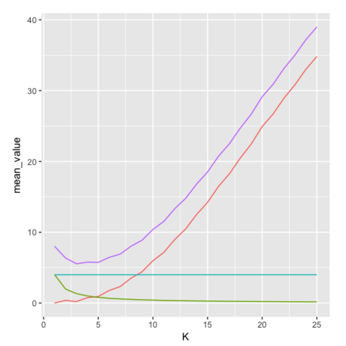

  
```{r setup, include=FALSE}
library(knitr)
knitr::opts_chunk$set(echo = TRUE,tidy=TRUE,message=FALSE,warning=FALSE,strip.white=TRUE,prompt=FALSE,
                      cache=TRUE, size="scriptsize",fig.width=4, fig.height=3,fig.align = "center")
```

```{r,eval=TRUE,echo=FALSE}
library("GGally")
library("ggfortify")
library("ggplot2")
library("knitr")
library("rmarkdown")
library("palmerpenguins")
library("tidyverse")
library("ISLR")
library("MASS")
library("class")
library("pROC")
library("formatR")
```


# Problem 1


## a)
We are now interested in decomposing the expected test MSE into three terms, the bias, variance and irreducible error. We have that
\begin{align*}
  E[(y_0 - \hat{f}(x_0))] = E[y_0 - f(x_0) + f(x_0) - \hat{f}(x_0)] =& E[(y_0 - f(x_0))^2] + E[(f(x_0) - \hat{f}(x_0))^2] \\
  +& 2E[(y_0 - f(x_0))(f(x_0) - \hat{f}(x_0))] 
\end{align*}
By looking at the last term, we use that $f$ is deterministic and $E[y_0] = f(x_0)$, therefore
\begin{align}
  E[(y_0 - f(x_0))(f(x_0) - \hat{f}(x_0))] = 0.
\end{align}
We therefore obtain the expression
\begin{align*}
  E[(y_0 - \hat{f}(x_0))] = E[(y_0 - f(x_0))^2] + E[(f(x_0) - \hat{f}(x_0))^2]
\end{align*}
where the first term on the R.H.S is the irreducible term $\text{Var}(\epsilon)$ (as $y_0 = f(x_0) + \epsilon$ and $\text{Var}(\epsilon) = E[\epsilon]^2$) and the second term on the R.H.S is the reducible term. To find an expression for the variance and bias, we expand the reducible term, i.e., 
\begin{align*}
  E[(f(x_0) - \hat{f}(x_0))^2] = E[f(x_0)^2] + E[\hat{f}(x_0)^2] - 2E[f(x_0)\hat{f}(x_0)]
\end{align*}
Now, to get any further, we use that $E[X^2] = \text{Var}[X] + E[X]^2$, so we can write
\begin{align*}
  E[(f(x_0) - \hat{f}(x_0))^2] = f(x_0)^2 + \text{Var}(\hat{f}(x_0)) + E[\hat{f}(x_0)]^2 - 2f(x_0)E[\hat{f}(x_0)],
\end{align*}
where we used that $E[f(x_0)] = f(x_0)$. We therefore end up with 
\begin{align*}
  E[(y_0 - \hat{f}(x_0))] = \text{Var}(\hat{f}(x_0)) + (f(x_0) - E[\hat{f}(x_0)])^2 + \text{Var}(\epsilon),
\end{align*}
where the terms on the RHS are the variance, squared bias and irreducible error, respectively.

## b)

\begin{itemize}
\item Irreducible error: The irreducible error occurs due to the noise in the data. No matter what algorithm is used, it will be present, hence the name irreducible.
\item Variance: Variance tells us how our model can adjust to new data. For example, a high variance will indicate that we have overfitted our model (to the noise in the data), and our performance on new data might not be as good. 
\item Bias: Bias tells us the difference between our predicted values and the actual value. A high bias will indicate that the predicted value is far away from the true value ( we are underfitting our model), while a low bias indicates that we our predicted value is close to the true value.
\end{itemize}

## c)\
\begin{enumerate}
\item Decreased $K$ corresponds to increased flexibility of the model: True
\item The variance increases with increased value of $K$: False
\item The blue line corresponds to the irreducible error: True
\item The squared bias decreases with increased value of $K$: False
\end{enumerate}




## d)
\begin{enumerate}
\item If the relationship between the predictors and response is highly non-linear, a flexible method will generally perform better than an inflexible method: False
\item If the number of predictors $p$ is extremely large and the number of observations $n$ is small, a flexible method will generally perform better than an inflexible method: False
\item In KNN classification, it is important to use the test set to select the value $K$, and not the training set, to avoid overfitting: False
\item In a linear regression setting, adding more covariates will reduce the variance of the predictor function: False
\end{enumerate}

## e)
Let $X = [x_1,x_2,x_3]^T$ be a 3-dimensionl random vector with covariance matrix
\begin{align}
\Sigma = 
\begin{bmatrix}
50 & 33 & 18 \\
33 & 38 & -10 \\
18 & -10 & 72
\end{bmatrix}
\end{align}
The correlation between element $x_1$ and $x_2$ of the vector $X$ is $0.76$. 


# Problem 2

```{r, eval=TRUE}
data(penguins)
head(penguins)
```


## a)
The following points are considered flaws in Basil's analysis: 
\begin{enumerate}
\item The Sex of the penguins should have not been excluded from the analysis. On the contrary, the very low p-value found in Basil's analysis suggests that we can reject the Null-hypothesis, and that there \emph{is} a very significant correlation between the sex and the body mass of the penguins. 
\item Basil asserts that the chinstrap penguins have the largest body mass, based on the estimated intercept $\hat{\beta}_{chinstrap}$. This is however a fallacy, as the linear model requires both a slope \emph{and} an intercept. Within Basil's model, the coefficient $\hat{\beta}_{bill_depth:chinstrap}$ is negative, meaning that overall the slope w.r.t. the bill depth is smaller than for the other species, correcting for the larger offset. Analyzing the graphical results of section b) it can be appreciated that actually Gentoo penguins have, on average, the highest body mass. 
\item Basil claims that the Null-hypothesis for the species interaction cannot be rejected on basis of the p-values of the species coefficients. This is however not a permissible conclusion, as the null-hypothesis of the underlying t-test does not test whether all species coefficients are simultaneously zero (we could only use the t-test in this manner if we were dealing with only two species). Using the \texttt{anova} function Basil would have seen that the F-statistic suggests that the species is a highly significant covariate. 
\end{enumerate}

## b) 
We use the \texttt{ggpairs} function to retrieve a graphical overview of the data. We highlight both the species, as well as the sex in two distinct plots. 
```{r, , fig.width=8, fig.height=8, eval=TRUE}
Penguins <- subset(penguins, select = -c(island, year))
ggpairs(Penguins, aes(colour = species,alpha = 0.75))
ggpairs(Penguins, aes(colour = sex, alpha = 0.75))
```

It is apparent that the Gentoo penguins have, on average, the highest body mass (as teased in a)), while the weight distribution for the other two species seems to be quite similar. Furthermore, we can appreciate from the second figure that the weight distribution for males of the same species is shifted to higher body masses, showing that sex is indeed an important predictor.  

## c)
Based on the knowledge from our graphical analysis that both the sex as well as the species influence the body weight, we set up a "naive" approach, in which we use both as interaction terms for all measured phenotypical covariates (i.e. bill length, bill depth and flipper length). 
```{r, eval=TRUE}
penguin.model <- lm(body_mass_g ~ (bill_depth_mm + bill_length_mm + flipper_length_mm)*species*sex, data = Penguins)
anova(penguin.model)
```

The ANOVA table reveals that all phenotypical covariates as well as species and sex are highly relevant in predicting penguin weight, as the Pr(>F) is < $10^-{10}$ for each. Only two double interactions terms have a Pr(>F) value of < 0.05 (\texttt{species:sex} and \texttt{flipper\_length\_mm:species:sex}), justifying the choice of a simpler model. The most significant interaction term is \texttt{bill\_depth\_mm:species}, giving us confidence in the initial expert model to which we will resort in the following. The proposed model is written as follows: 

\begin{align}
\hat{y}_{adelie,f} &= \hat{\beta}_0 + \hat{\beta}_{fl}x_{fl} + \hat{\beta}_{bd}x_{bd} \\
\hat{y}_{adelie,m} &= \hat{\beta}_0 + \hat{\beta}_{fl}x_{fl} + \hat{\beta}_{bd}x_{bd} + \hat{\beta}_{m} \\
\hat{y}_{chinstrap,f} &= \hat{\beta}_0 + \hat{\beta}_{fl}x_{fl} + (\hat{\beta}_{bd} + \hat{\beta}_{bd,chinstrap}) + \hat{\beta}_{chinstrap}\\
\hat{y}_{chinstrap,m} &= \hat{\beta}_0 + \hat{\beta}_{fl}x_{fl} + (\hat{\beta}_{bd} + \hat{\beta}_{bd,chinstrap}) + \hat{\beta}_{chinstrap} + \hat{\beta}_{m} \\
\hat{y}_{gentoo,f} &= \hat{\beta}_0 + \hat{\beta}_{fl}x_{fl} + (\hat{\beta}_{bd} + \hat{\beta}_{bd,gentoo}) + \hat{\beta}_{gentoo}\\
\hat{y}_{gentoo,m} &= \hat{\beta}_0 + \hat{\beta}_{fl}x_{fl} + (\hat{\beta}_{bd} + \hat{\beta}_{bd,gentoo}) + \hat{\beta}_{gentoo} + \hat{\beta}_{m} \\
\end{align}
in which the subscripts \texttt{fl, bd} and \texttt{m} stand for flipper length, bill depth and male sex, respectively. We fit the expert model and analyse the results. 

```{r, eval = TRUE}
expert.model <- lm(body_mass_g ~ flipper_length_mm + sex + bill_depth_mm * species, data = Penguins)
sigma <- summary(expert.model)$sigma
rsq <- summary(expert.model)$r.squared
adjrsq <- summary(expert.model)$adj.r.squared
summary(expert.model)
anova(expert.model)
```
The expert model seems to have increased the accuracy in our predictions as compared to Basil's model, with a now higher adjusted $R^2$ of $`r adjrsq`$ and slightly lower residual standard error of `r sigma``. Based on the ANOVA table and the results of the t-test we can reject the null hypothesis that any of our covariates is statistically insignificant (i.e., that any of the corresponding coefficients is zero). As stated in subquestion a), the results of the ANOVA table are required for our hypothesis testing concerning the species, as we are dealing with three distinct groups there. In contrast to Basil, we do not attempt to infer any meaning into the absolute values of the coefficients, as this would be a slippery slope considering the various levels and interactions. Instead, we resort to assessing the model fit and whether we have introduced any systematic error in our model. To do so, we analyse the distribution of the residuals:
```{r, eval = TRUE}
res <- resid(expert.model)
qqnorm(res)
qqline(res)
plot(density(res))
meanres <- mean(res)
meanres
```
In the QQ-plot, the data plots seem to lie on a 45-degree straight line, indicating that our data is normally distributed. Only in the low and high theoretical quantile regions (i.e. below -2 and over 2) do some outliers stray from this line. Overall, the plot however suggests that the residuals are normally distributed, and that our model fits the data well. This conclusion is fortified by the plot of the probability density of the residuals, which looks like a bell-shape curve. Although there seems to be a slight skewness to the curve, the calculated mean of the residuals turn out to be extremely close to zero at $`r round(meanres,3)`$. Therefore, we conclude that our residuals are normally distributed, and that our model represents the data very well. 


# Problem 3

```{r, echo=FALSE}
# Here is a code chunk for training and test set preparation: 
rm(list=ls())

data(penguins)

# create a subset of the data (remove island and year variables)----------------
Penguins <- subset(penguins, select = -c(island, year))

# create a new boolean variable indicating whether or not the penguins is an 
# Adelie penguin
Penguins$adelie <- ifelse(Penguins$species == "Adelie",1,0)
Penguins$True_species <- ifelse(Penguins$species == "Adelie","Adelie","Other")

# select only relevant variables and remove all rows with missing values in 
# body mass, flipper length, sex or species
Penguins_reduced <- Penguins %>% dplyr :: select(body_mass_g, flipper_length_mm, adelie, True_species) %>%
  mutate(body_mass_g = as.numeric(body_mass_g), flipper_length_mm = as.numeric(flipper_length_mm)) %>%
  drop_na()

set.seed(4268)

# create training and test set--------------------------------------------------
training_set_size <- floor(0.7 * nrow(Penguins_reduced))
train_ind <- sample(seq_len(nrow(Penguins_reduced)), size = training_set_size)
train <- Penguins_reduced[train_ind, ]
test <- Penguins_reduced[-train_ind, ]
```

## a) (5P)
### 1) Fit a logistic regression model using the training set, and perform the classification on the test set, using a 0.5 cutoff (1P).

Here is code chunk:

```{r, eval=TRUE}
# fit a logistic regression model-----------------------------------------------
glm_default2 = glm(adelie ~ body_mass_g + flipper_length_mm, data = train, family = "binomial")
summary(glm_default2)$coef

# calculate probability---------------------------------------------------------
test$prob_glm <- 0
size = dim(test)
len = size[1]

for(i in 1:len){
  eta <- summary(glm_default2)$coef[1,1] + summary(glm_default2)$coef[2,1]*test[i,1] + summary(glm_default2)$coef[3,1] * test[i,2] 
  test$prob_glm[i] <- exp(eta)/(1+exp(eta))
}

# Perform classification using a 0.5 cutoff-------------------------------------
cutoff <- 0.5
test$predicted_class_glm <- ifelse(test$prob_glm >= cutoff, 1, 0)

```

Here is a plot of test set in which true species are indicated by color and predicted species are indicated by shape:
```{r, fig.width=6, fig.height=4, echo=FALSE}
test$predicted_class_glm_ch <- ifelse(test$prob_glm >= cutoff, "Adelie", "Other")
ggplot() +
  geom_point(data = test, aes(y=flipper_length_mm, x = body_mass_g, colour = True_species, shape = predicted_class_glm_ch), size = 2)+
  xlab("Body mass [g]")+
  ylab("Flipper length [mm]")+
  theme(axis.text = element_text(size=14), axis.title = element_text(size=18), )
```


### 2) Fit a QDA model using the training set, and perform the classification on the test set, using a 0.5 cutoff (1P).

Here is code chunk:

```{r, eval=TRUE}
# fit a QDA model---------------------------------------------------------------
penguins_qda = qda(True_species ~ body_mass_g + flipper_length_mm, data = train, prior = c(1,1)/2)
summary(penguins_qda)

# calculate probability---------------------------------------------------------
Posterior = predict(penguins_qda, newdata = test)$posterior
test$prob_qda <- Posterior[,1]

# Perform the classification using a 0.5 cutoff---------------------------------
cutoff <- 0.5
test$predicted_class_qda <- ifelse(Posterior[,1] >= cutoff, 1, 0)
```

Here is a plot of test set in which true species are indicated by color and predicted species are indicated by shape:
```{r, fig.width=6, fig.height=4, echo=FALSE}
test$predicted_class_qda_ch <- ifelse(Posterior[,1] >= cutoff, "Adelie", "Other")
ggplot() +
  geom_point(data = test, aes(y=flipper_length_mm, x = body_mass_g, colour = True_species, shape = predicted_class_qda_ch), size = 2)+
  xlab("Body mass [g]")+
  ylab("Flipper length [mm]")+
  theme(axis.text = element_text(size=14), axis.title = element_text(size=18), )
```


### 3) Finally, do the same as 1) and 2) using KNN with k = 25 (1P).

Here is code chunk:

```{r, eval=TRUE}
# prepare data set containing only covariates-----------------------------------
new_train <- subset(train, select = c(body_mass_g,flipper_length_mm))
new_test <- subset(test, select = c(body_mass_g,flipper_length_mm))

# fit a KNN model---------------------------------------------------------------
knnMod = knn(new_train,new_test, cl = train$adelie, k = 25, prob = T)
summary(knnMod)

# precidted class
test$predicted_class_knn <- knnMod

# probability of being adelie
test$prob_knn <- ifelse(knnMod == 0, 1-attributes(knnMod)$prob, attributes(knnMod)$prob)

```

Here is a plot of test set  in which true species are indicated by color and predicted species are indicated by shape:
```{r, fig.width=6, fig.height=4, echo=FALSE}
test$predicted_class_knn_ch <- ifelse(test$predicted_class_knn == 1, "Adelie", "Other")
ggplot() +
  geom_point(data = test, aes(y=flipper_length_mm, x = body_mass_g, colour = True_species, shape = predicted_class_knn_ch), size = 2)+
  xlab("Body mass [g]")+
  ylab("Flipper length [mm]")+
  theme(axis.text = element_text(size=14), axis.title = element_text(size=18), )
```


### 4) calculate the sensitivity and specificity for the three predictions performed on the test set (2P).

Here is code chunk to calculate the sensitivity and specificity:
```{r, echo=TRUE}
table_glm <- table(predicted = test$predicted_class_glm, true = test$adelie)
table_qda <- table(predicted = test$predicted_class_qda, true = test$adelie)
table_knn <- table(predicted = test$predicted_class_knn, true = test$adelie)

Sensitivity_glm = table_glm[2,2] / (table_glm[1,2] + table_glm[2,2])
Sensitivity_qda = table_qda[2,2] / (table_qda[1,2] + table_qda[2,2])
Sensitivity_knn = table_knn[2,2] / (table_knn[1,2] + table_knn[2,2])

Specificity_glm = table_glm[1,1] / (table_glm[1,1] + table_glm[2,1])
Specificity_qda = table_qda[1,1] / (table_qda[1,1] + table_qda[2,1])
Specificity_knn = table_knn[1,1] / (table_knn[1,1] + table_knn[2,1])
```


Sensitivity for logistic regression:
```{r, echo=FALSE}
Sensitivity_glm
```

Sensitivity for QDA:
```{r, echo=FALSE}
Sensitivity_qda
```

Sensitivity for KNN:
```{r, echo=FALSE}
Sensitivity_knn
```

Specificity for logistic regression:
```{r, echo=FALSE}
Specificity_glm
```

Specificity for QDA:
```{r, echo=FALSE}
Specificity_qda
```

Specificity for KNN:
```{r, echo=FALSE}
Specificity_knn
```


## b) (5P)
### 1) Present a plot of ROC curves and calculate the area under the curve (AUC) for each of the classifiers in a) (1P for each model).

Here is code chunk to calculate sensitivity and specificity for various cutoff values:
```{r, eval=TRUE}

# calculate sensitivity and specificity for various cutoff values---------------
Sens_glm <- 0
Sens_qda <- 0
Sens_knn <- 0
Spec_glm <- 0
Spec_qda <- 0
Spec_knn <- 0

i <- 1
for(cutoff in 1000:0){

  cutoff <- cutoff/1000
  test$predicted_class_glm <- ifelse(test$prob_glm >= cutoff, 1, 0)
  test$predicted_class_qda <- ifelse(test$prob_qda >= cutoff, 1, 0)
  test$predicted_class_knn <- ifelse(test$prob_knn >= cutoff, 1, 0)
  
  TN_glm <- ifelse(test$adelie == 0, ifelse(test$predicted_class_glm == 0, 1, 0), 0)
  TP_glm <- ifelse(test$adelie == 1, ifelse(test$predicted_class_glm == 1, 1, 0), 0)
  TN_qda <- ifelse(test$adelie == 0, ifelse(test$predicted_class_qda == 0, 1, 0), 0)
  TP_qda <- ifelse(test$adelie == 1, ifelse(test$predicted_class_qda == 1, 1, 0), 0)
  TN_knn <- ifelse(test$adelie == 0, ifelse(test$predicted_class_knn == 0, 1, 0), 0)
  TP_knn <- ifelse(test$adelie == 1, ifelse(test$predicted_class_knn == 1, 1, 0), 0)
  
  FN_glm <- ifelse(test$adelie == 1, ifelse(test$predicted_class_glm == 0, 1, 0), 0)
  FP_glm <- ifelse(test$adelie == 0, ifelse(test$predicted_class_glm == 1, 1, 0), 0)
  FN_qda <- ifelse(test$adelie == 1, ifelse(test$predicted_class_qda == 0, 1, 0), 0)
  FP_qda <- ifelse(test$adelie == 0, ifelse(test$predicted_class_qda == 1, 1, 0), 0)
  FN_knn <- ifelse(test$adelie == 1, ifelse(test$predicted_class_knn == 0, 1, 0), 0)
  FP_knn <- ifelse(test$adelie == 0, ifelse(test$predicted_class_knn == 1, 1, 0), 0)
  
  Sens_glm[i] <- sum(TP_glm) / (sum(TP_glm)+sum(FN_glm))
  Sens_qda[i] <- sum(TP_qda) / (sum(TP_qda)+sum(FN_qda))
  Sens_knn[i] <- sum(TP_knn) / (sum(TP_knn)+sum(FN_knn))
  
  Spec_glm[i] <- sum(TN_glm) / (sum(TN_glm)+sum(FP_glm))
  Spec_qda[i] <- sum(TN_qda) / (sum(TN_qda)+sum(FP_qda))
  Spec_knn[i] <- sum(TN_knn) / (sum(TN_knn)+sum(FP_knn))
  
  i <- i+1
}


# Preapare plot data------------------------------------------------------------
plotdata <- tibble(
  Sens_glm = Sens_glm,
  Sens_qda = Sens_qda,
  Sens_knn = Sens_knn,
  Spec_glm = 1-Spec_glm,
  Spec_qda = 1-Spec_qda,
  Spec_knn = 1-Spec_knn,
)


```

Here is a plot for ROC curves
(Red: Logistic regression,
Yellow: QDA,
Black: KNN):

```{r, echo=FALSE}
# ROC plot----------------------------------------------------------------------
x_dummy = 0:1
y_dummy = 0:1

ggplot() +
  geom_line(data = plotdata, aes(y=Sens_glm, x = Spec_glm), colour = "red", size = 2)+
  geom_line(data = plotdata, aes(y=Sens_qda, x = Spec_qda), colour = "yellow", size = 2)+
  geom_line(data = plotdata, aes(y=Sens_knn, x = Spec_knn), colour = "black", size = 2)+
  geom_line(aes(y=y_dummy, x = x_dummy), colour = "gray", size = 1, linetype="dashed")+
  xlab("1-Specificity")+
  ylab("Sensitivity")+
  theme(axis.text = element_text(size=14), axis.title = element_text(size=18), )
```

Here is code chunk to calculate AUC:
```{r, echo=TRUE}
# AUC calculation---------------------------------------------------------------
AUC_glm <- 0;
AUC_qda <- 0;
AUC_knn <- 0;

for(i in 2:length(Spec_glm)){
  if(plotdata$Spec_glm[i] > plotdata$Spec_glm[i-1]){
    AUC_glm <- AUC_glm + (plotdata$Spec_glm[i]-plotdata$Spec_glm[i-1]) * (plotdata$Sens_glm[i]+plotdata$Sens_glm[i-1]) / 2
  }
  if(plotdata$Spec_qda[i] > plotdata$Spec_qda[i-1]){
    AUC_qda <- AUC_qda + (plotdata$Spec_qda[i]-plotdata$Spec_qda[i-1]) * (plotdata$Sens_qda[i]+plotdata$Sens_qda[i-1]) / 2
  }
  if(plotdata$Spec_knn[i] > plotdata$Spec_knn[i-1]){
    AUC_knn <- AUC_knn + (plotdata$Spec_knn[i]-plotdata$Spec_knn[i-1]) * (plotdata$Sens_knn[i]+plotdata$Sens_knn[i-1]) / 2
  }
}

```

AUC for logistic regression:
```{r, echo=FALSE}
AUC_glm
```

AUC for QDA:
```{r, echo=FALSE}
AUC_qda
```

AUC for knn:
```{r, echo=FALSE}
AUC_knn
```


### 2) Briefly discuss the ROC curves and the AUC. Which model performs best and worst (1P)?

ROC curves of Logistic regression and QDA are similar and closer to the top left corner than that of KNN.
AUCs of Logistic regression and QDA are similar and larger than that of KNN.
Logistic regression and QDA therefore perform similarly and better than the KNN.


### 3) If the task is to create an interpretable model, which model would you choose (1P)?
As mentioned above, logistic regression and QDA perform similarly and better than the KNN, however, logistic regression makes no assumptions about the covariates and preferred for interpretability.


## c) (1P) Single choice
### we are again looking at the logistic regression model that you fitted to the training data in a). According to this model, how would the odds that an observed animal is from the Adelie species change if the body mass increases by 1000g?

The coefficient for the body mass is 0.000712:
```{r, echo=FALSE}
summary(glm_default2)$coef
```

The odds therefore increase by exp(0.000712*1000) =
```{r, echo=FALSE}
exp(summary(glm_default2)$coef[2,1] * 1000)
```

The correct value is $2.038$.


## d) (2P) 
### Plot the full data with the two covariates as the x- and y-axis, and use color and some other attribute of your choice (e.g. shape of highlight) to visualize the true species as well as the predicted species from the best model in b).

Here is code chunk to calculate the probability and perform the classification for full data:
```{r, echo=TRUE}
# calculate probability for full data-------------------------------------------
size = dim(Penguins_reduced)
len = size[1]

for(i in 1:len){
  eta <- summary(glm_default2)$coef[1,1] + summary(glm_default2)$coef[2,1]*Penguins_reduced[i,1] + summary(glm_default2)$coef[3,1] * Penguins_reduced[i,2] 
  Penguins_reduced$prob_glm[i] <- exp(eta)/(1+exp(eta))
}

# perform the classification----------------------------------------------------
cutoff <- 0.5
Penguins_reduced$predicted_class_glm <- ifelse(Penguins_reduced$prob_glm >= cutoff, 1, 0)
Penguins_reduced$Predicted_species <- ifelse(Penguins_reduced$predicted_class_glm == 1,"Adelie","Other")
```

Here is a plot:
```{r, fig.width=7, fig.height=4, echo=FALSE}
ggplot() +
  geom_point(data = Penguins_reduced, aes(y=flipper_length_mm, x = body_mass_g, colour = True_species, shape = Predicted_species), size = 2)+
  xlab("Body mass [g]")+
  ylab("Flipper length [mm]")+
  theme(axis.text = element_text(size=14), axis.title = element_text(size=18), )
```

# Problem 4

## a)

\begin{enumerate}
\item The validation set-approach is computationally cheaper than 10-fold CV: True
\item 5-fold CV will generally lead to less bias, but more variance than LOOCV in the estimated prediction error: True
\item The validation set-approach is the same as 2-fold CV: True
\item LOOCV is always the cheapest way to do cross-validation: True
\end{enumerate}

## b)
We load the dataset and use logistic regression as our model.
```{r, eval=TRUE}
# Load the data
id <- "1chRpybM5cJn4Eow3-_xwDKPKyddL9M2N"  # google file ID
d.chd <- read.csv(sprintf("https://docs.google.com/uc?id=%s&export=download", id))

summary(d.chd) # Get an overview of the dataset

method = 'binomial' # logistic regression in GLM
test_sbp = 150 # this sbp is larger than the mean (130.2), and close to the max (157.1)
test_sex = 1 # male
test_smoking = 0 # non-smoking

# Logistic regression
model_4b <- glm(chd ~ sbp + sex + smoking, 
             data = d.chd, 
             family = method
             )


# Make a test subject 
test_subject = data.frame(sbp = test_sbp, 
                          sex = test_sex, 
                          smoking = test_smoking) 

# Make prediction on test subject
probability = predict(model_4b, 
            test_subject, 
            type = 'response')

print(c('The probability that a male of...', probability))

sprintf('The probability of a non-smoking male with %i having chd is %#.3f', test_sbp, probability)

summary(model_4b) # to compare with task 4d

```
We see that the mean sbp is 130.2 and the max is 157.1. We want to predict if a non-smoking male with sbp = 150 has chd. We find from the given dataset that a non-smoking male with sbp = 150 will only have a 10% of having chd.

## c)
```{r, eval=TRUE}

set.seed(1)

observations = dim(d.chd)[1]

b_iter = 1000 # number of bootstrap iterations

estimation = c()

for (i in 1:b_iter){
  model_4c <- glm(chd ~ sbp + sex + smoking, 
                  data = d.chd, 
                  family = method, 
                  subset = sample(observations, size = observations, replace = TRUE))
  
  estimated = predict(model_4c, test_subject, type = 'response')
  
  # store the estimated probability on test subject
  estimation[i] = estimated
}


```


### c) Standard error

To calculate the standard error, we use the formula (from ch. 5 in the book ISLR)
\begin{align}
\text{SE}_B = \sqrt{\frac{1}{B-1} \sum_{i=1}^B \bigg(\text{estimation}_i - \frac{1}{B} \sum_{j=1}^B \text{estimation}_j\bigg)^2}
\end{align}


```{r, eval=TRUE}

mean = mean(estimation)

SE_B = sqrt(1/(b_iter - 1)*sum((estimation - mean)^2))


sprintf('The standard error calculated is %#.3f', SE_B)

```

### c) Confidence interval and mean
For a confidencen interval of 95\%:
```{r, eval=TRUE}
z = 1.96
CI_interval = c()
CI_interval[1] = mean - z*SE_B
CI_interval[2] = mean + z*SE_B

sprintf('The confidence interval is [%#.3f,%#.3f] with mean %#.3f', CI_interval[1], CI_interval[2], mean)

```

### c) Comment on results

The confidence interval of 95\% (CI95) tells us that the true mean, for $95\%$ of the population of non-smoking males with sbp=150, will lie in the interval $[0.021,0.194]$. 

We observe that we get quite a spread in our CI95, and the values seems a bit low for such a high sbp. To understand why, we should analyze the data. By looking at the data, we find that there are 47 cases of females with chd, while only 14 cases of male with chd. By plotting the sbp vs. chd, separated by sex, we also observe that the values are quite spread for both genders. These reasons may explain why we get such a low probability of male having chd with such a high sbp. If we run the code for a non-smoking female with sbp=150, we get a mean probability of $0.311$, and the CI95 interval $[0.151,0.471]$, which seems more plausible. To get a more accurate model, one would probably have to include more variables, such as weight, age and eating and exercise habits. 


```{r, fig.width=6, fig.height=3, echo = FALSE}

# Look at how many cases of chd=True and male
sprintf('Males with chd in dataset is %i', sum(d.chd$chd == 1 & d.chd$sex == 1))

# Look at how many cases of chd=True and female
sprintf('Females with chd in the dataset is %i', sum(d.chd$chd == 1 & d.chd$sex == 0))

ggplot(d.chd) +
  geom_point(aes(x = sbp, y = chd, color = sex))

hist(estimation, xlim=c(0,0.25), breaks=15)

```

## d)
\begin{enumerate}
\item The bootstrap relies on random sampling the same data without replacement: False
\item The estimated standard errors from the glm() function are smaller than those estimated from the bootstrap, which indicates a problem with the bootstrap: False
\item In general, differences between the estimated standard errors from the bootstrap and those from glm() may indicate a problem with the assumptions taken in logistic regression.: True
\item The $p$-values from the glm() output are probably slightly too small: True
\end{enumerate}

